# 项目架构UML图

本文档包含了拼图游戏项目的各种UML图表，用于可视化项目的架构和数据结构。

## 类图 (Class Diagram)

### 核心数据结构类图

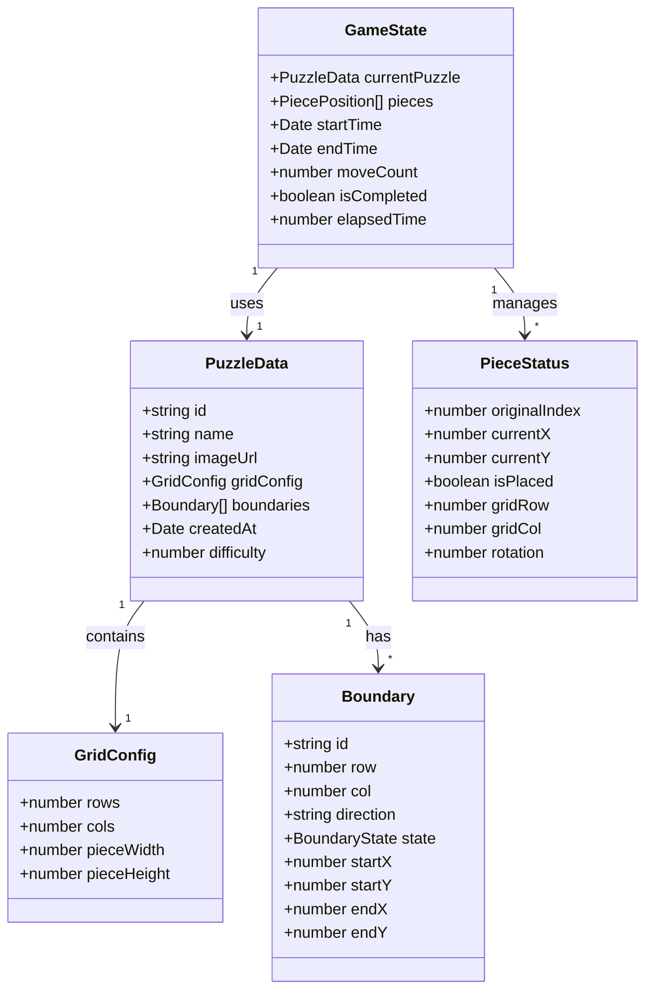

### 应用层架构类图

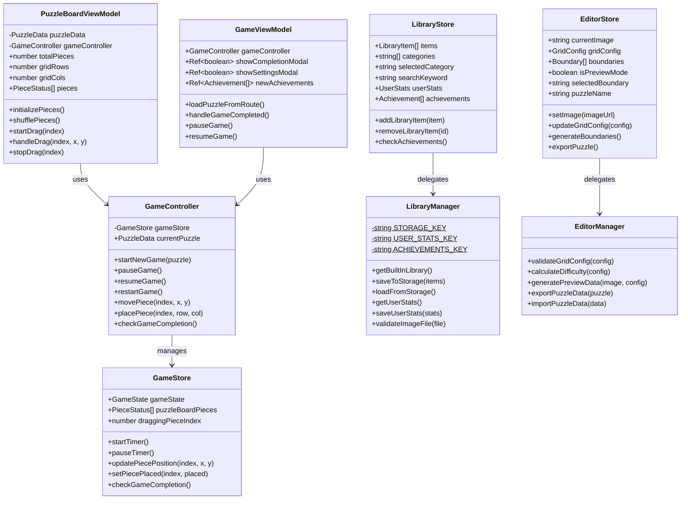

### 用户和成就系统类图

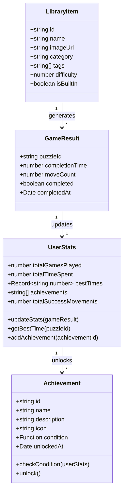

## 序列图 (Sequence Diagram)

### 游戏开始流程

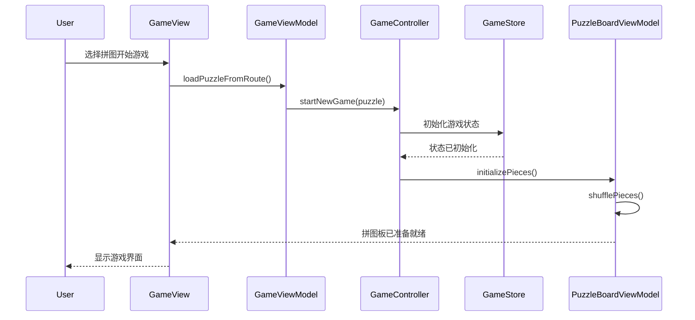

### 拼图块移动流程

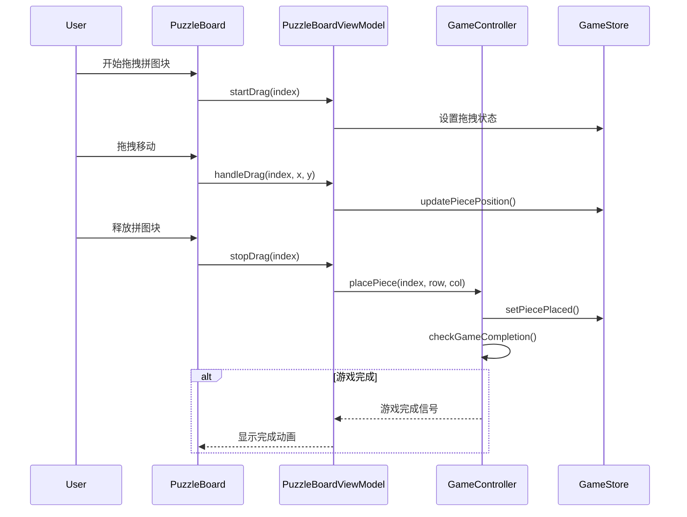

### 素材库管理流程

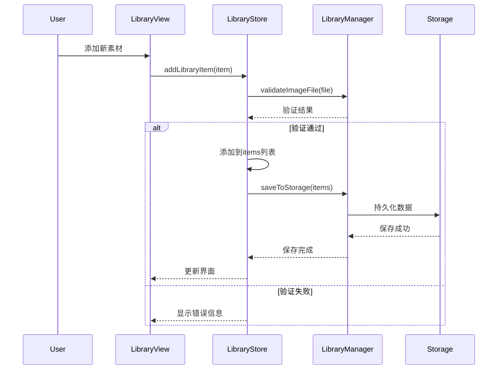

## 活动图 (Activity Diagram)

### 游戏完整流程

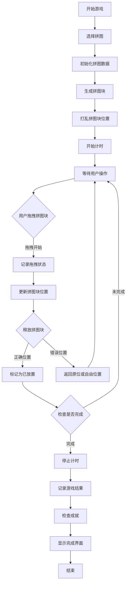

### 拼图编辑流程

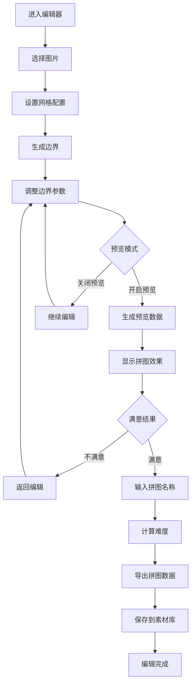

## 状态图 (State Diagram)

### 游戏状态转换

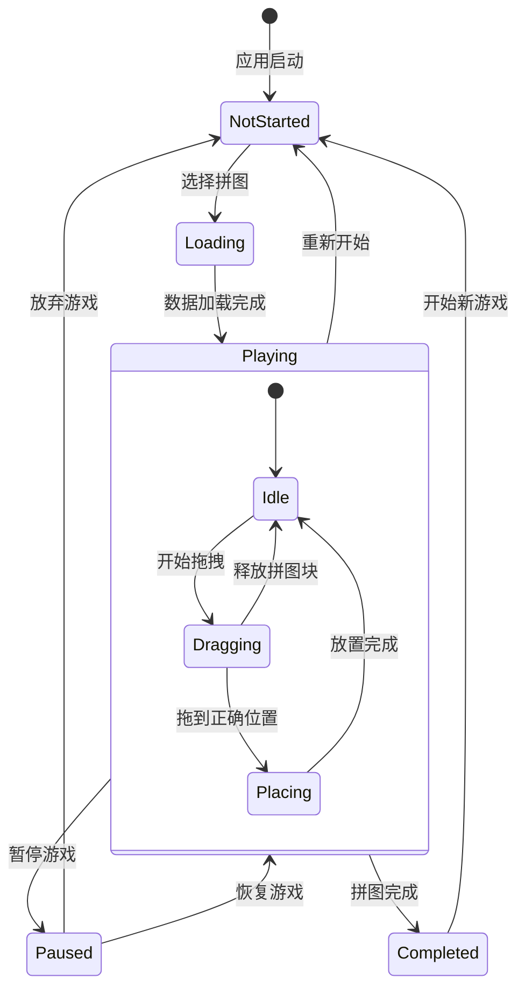

### 拼图块状态

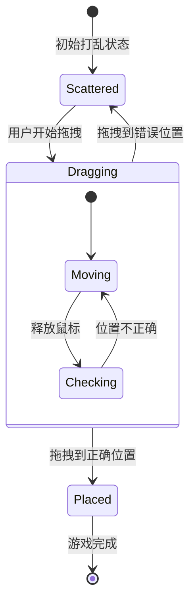

## 组件图 (Component Diagram)

### 系统组件架构

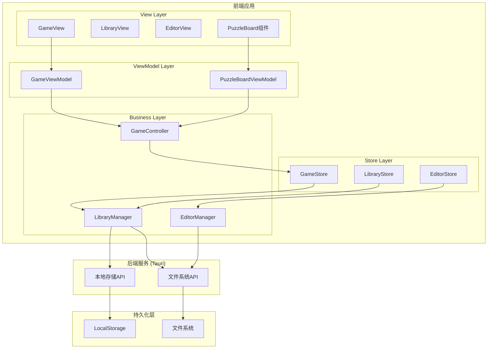

这些UML图表提供了项目架构的完整视图：

1. **类图**: 展示了数据结构和类之间的关系
2. **序列图**: 描述了关键业务流程的时间顺序
3. **活动图**: 展示了业务流程的逻辑步骤
4. **状态图**: 描述了对象状态的转换
5. **组件图**: 展示了系统的整体架构和组件关系

这些图表有助于理解系统的设计思路和实现方式，为后续的开发和维护提供参考。
